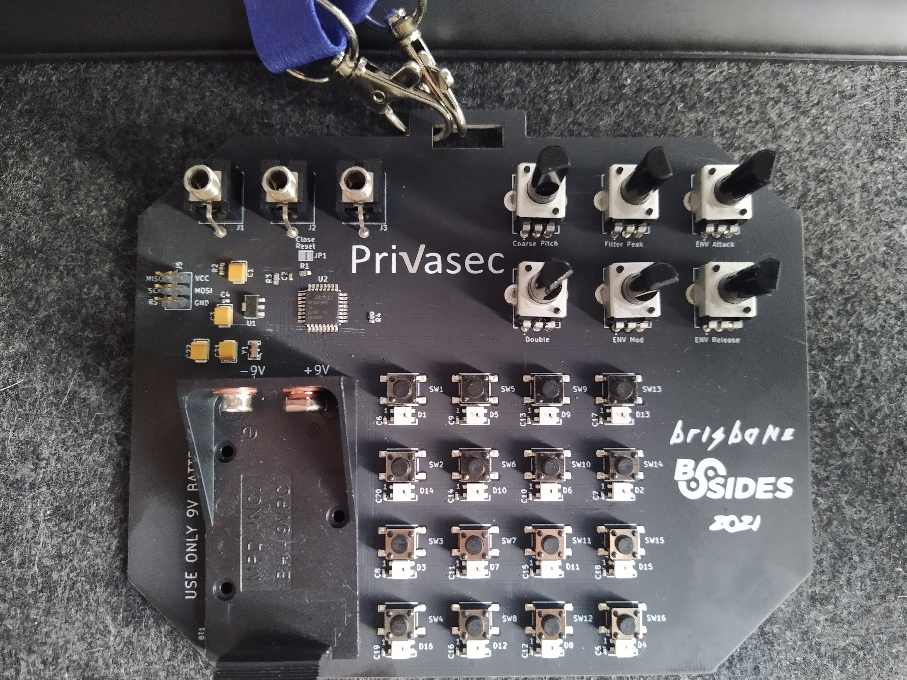
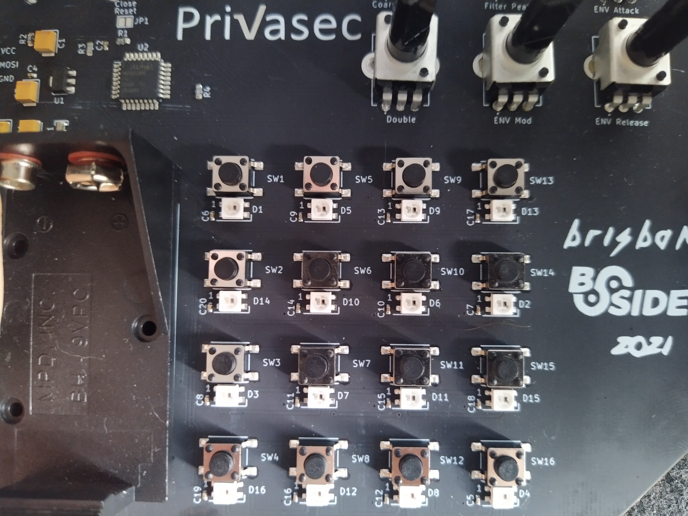
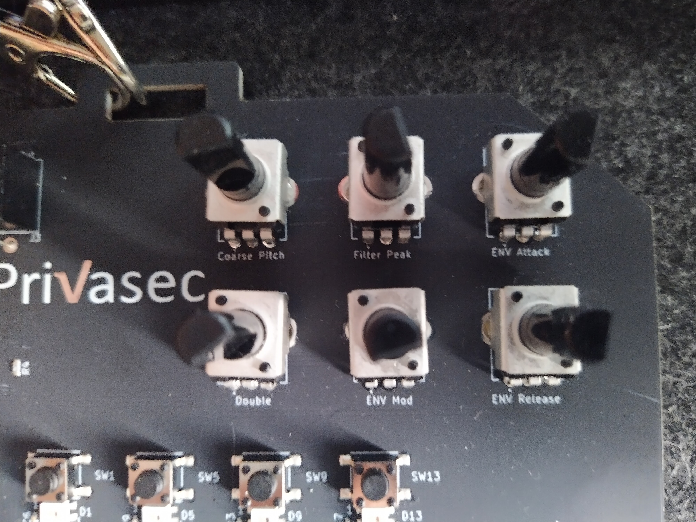
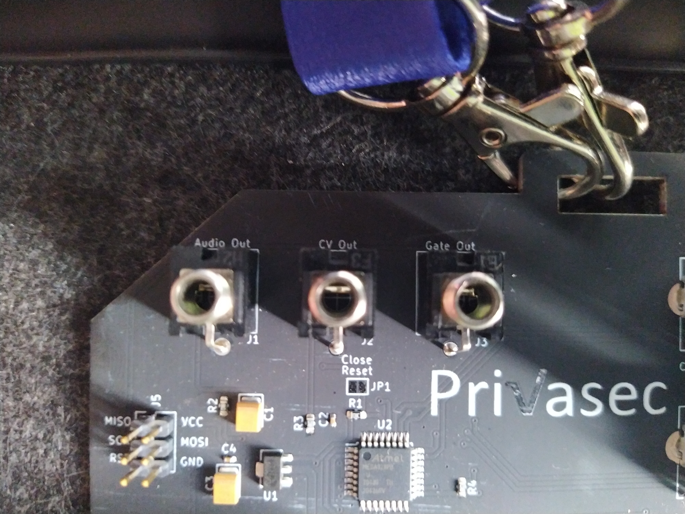
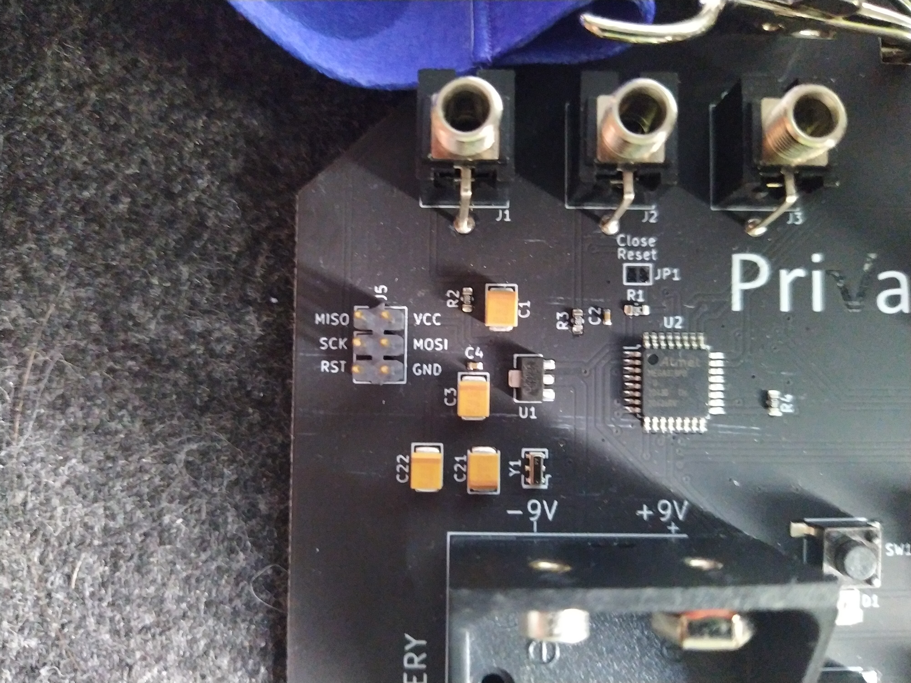

# Bsides Brisbane 2022 badge

Bsides Brisbane 2021/2022 released a badge that appears to be a Synthesizer to align with this years theme of retro synthwave. This repo will be a collection of research on what the features of the badge are and how to use it.

Thankfully the badge came with a 3.5mm male to male cable and a 9v battery. I was able to connect this to an external speaker and play around making noises.
***
### Inputs

The inputs are a 16 mini push switches, these have corresponding surface LED's, when pressing the switches on rows 1 and 3 the LED with the switch would turn on. Interestingly the switches on row 2 or 4 have the the LED in the opposite column. Switch bottom rights is Labelled SW16, the LED bottom Left is labelled D16 and turns on when the SW16 switch is activated.
***
### Adjusters

There are 6 potentiometers to adust various settings. I have no idea what any of these mean but I've Used [Roland - A to Z of Synth terms](https://rolandcorp.com.au/blog/a-to-z-synthesizer) to put together the following table.

|  Label  |  Full Name  |  Description  | Plain English |
|---------|-------------|---------------|---------------|
| Coarse Pitch | aka Coarse Tune | This is used to adjust the pitch in semitone steps | No bloomin idea |
| Filter Peak | | Filter used to eliminate the highest sound pressure levels | Removes the top end? |
| ENV Attack | Envelope Attach| The first stage in the ADSR sound ENVELOPE, which describes how a sound varies with time. When the envelope controls the AMPLIFIER (VCA), the attack is the time it takes for the start of the sound to reach its maximum volume. | A xylophone has a short attack as you can hear the maximum volume of the sound immediately as the mallet strikes the bar whereas a woodwind has a slower attack as it takes a longer time for air to move through the instrument. |
| Double | | ?? Pass | ?? Still Pass |
| ENV Mod | Envelope Modulation | A method that uses CONTROL VOLTAGE to add movement and expression to a sound. A VOLTAGE is applied by either a physical action or electronically. Voltage is applied to a parameter that then oscillates the signal’s PITCH, FILTER or GAIN. | |
| ENV Release | Envelope Release | The fourth and last stage in the ADSR sound ENVELOPE, which describes how a sound varies with time. When the envelope controls the AMPLIFIER (VCA), the release is the time it takes for the end of the sound to reach its minimum volume. | |
***
### Outputs

#### Audio Out

Appears to be a simple mono 3.5mm output for headphones or a speaker.

#### CV Out - Control Voltage Out

used by ANALOG synthesizers to control the OSCILLATORS, FILTERS, ENVLEOPES and other components.

#### Gate Out

A signal that can turn on and off; ON when holding down a key, OFF when releasing the key. A gate signal can turn a note on or off, change the stages of an ENVELOPE or start/stop a SEQUENCE. Can also refer to a DYNAMIC effect that cuts off a sound below a certain decibel level.
***
### Socket/Jumpers

There is a Jumper/Socket labelled J5. I suspect that this is used to program the board. The pins are as follows:

**MISO** - Master In Slave Out
**VCC** - Voltage at the Common Collector
**SCK** - Serial Clock
**MOSI** - Master Out Slave In
**RST** - Reset/Restart
**GND** - Ground
***

### Chips
There are two onboard chips on the board labelled U1 and U2. So far I've been able 

U1 - 6209 A940/50
U2 - Atmel MEGA328PB 204030